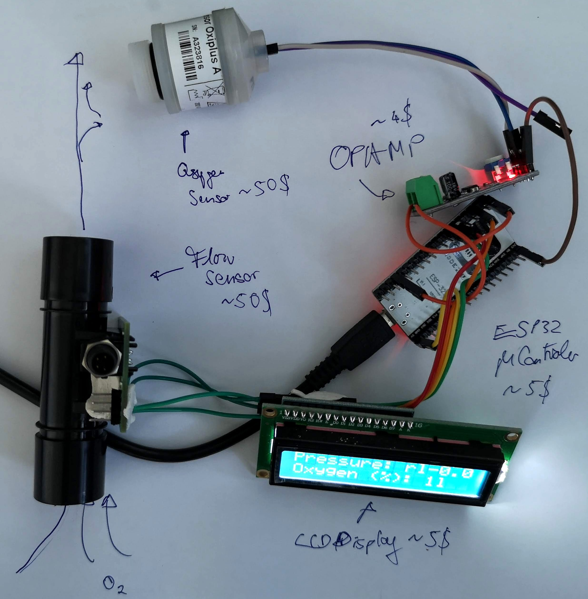
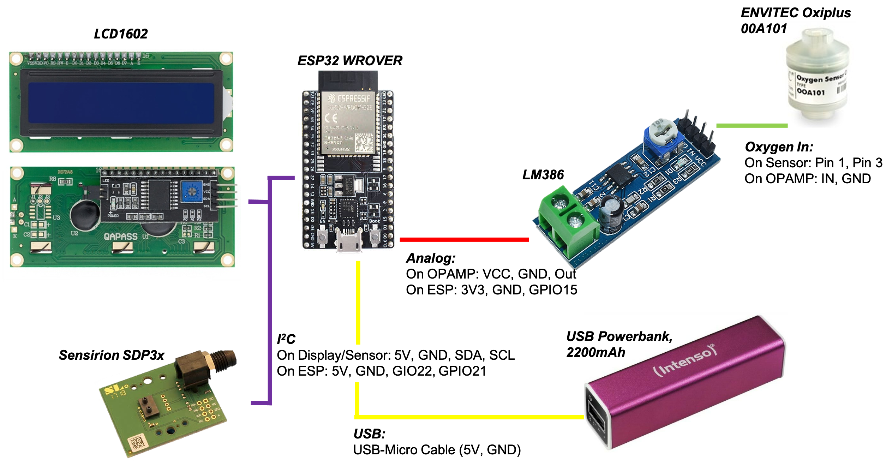
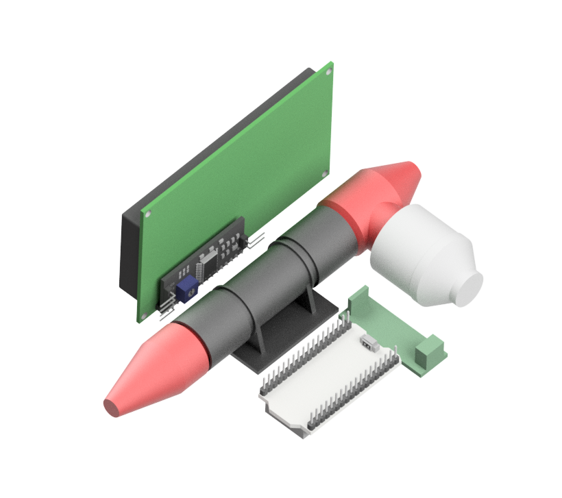
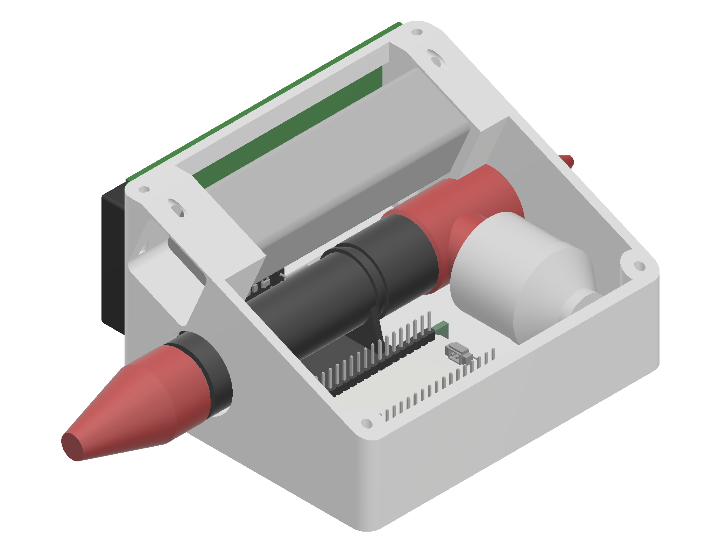

# Open Oxygen (O2) Flow Sensor

**WORK IN PROGRESS - more information will follow soon!**

This device is supposed to measure the oxygen flowrate of oxygen bottles.

***Features:***

- Open-Source
- Low-Cost (~150€)
- Based on 3D parts + off-the-shelf components
- Minimum of tools required

# Electronics

The flowsensor and the display are connected to the ESP32 via I2C (GPIO 21/22 for SDA/SCL), wheras the Oxygen Sensor is connected to the board via an ampliefied (i.e. OPAMP) digital-analog port.

*WARNING:* The OPAMP has a high-pass filter created by a capacitor + resistor. We need to remove this to let the low-frequency signal from the Oxygen Sensor pass through.

# CAD Files

The parts were designed in Autodesk Inventor 2019 student edition and can be found in the folder [./CAD](CAD)
An enclosure/box to keep all parts in place will be 3D printable.

*Arrangement of all the parts*

## Housing for the setup

The setup will have a housing for all the parts. Currently it looks like this, where the battery is sitting on top:

*Arrangement of all the parts*

All **3D printable** files will be found in [./CAD/STL](./CAD/STL)

# Software

A first attempt to connect all components can be found in [./ARDUINO](./ARDUINO) (even though it's used by an ESP32, flash it in the Arduino IDE)

# Bill of materials

- Misc Wires for connecting all parts (use proper soldered connection!)
- USB micro Cable for flashing the firmware
- [I2C LCD Display](https://de.aliexpress.com/item/32413056677.html?spm=a2g0o.productlist.0.0.37d82e0cBbmYmX&algo_pvid=b23eb3fa-26b7-4967-8927-370bceaf8f2b&algo_expid=b23eb3fa-26b7-4967-8927-370bceaf8f2b-0&btsid=0b0a050116225252291684896e9a75&ws_ab_test=searchweb0_0,searchweb201602_,searchweb201603_), **1,82€**
- [LM386 Breakoutboard](https://de.aliexpress.com/item/32923555534.html?spm=a2g0o.productlist.0.0.241cc1a74BaRag&algo_pvid=a1d5b181-2755-43ee-b3bf-51264a125677&algo_expid=a1d5b181-2755-43ee-b3bf-51264a125677-0&btsid=0b0a050116225251428054610e9a75&ws_ab_test=searchweb0_0,searchweb201602_,searchweb201603_) (Need to be modified - remove the highpass filter by bridging one of the capacitors *need to check this again!*; **0,32€**
- [ESP32](https://de.aliexpress.com/item/1005002624723822.html?spm=a2g0o.productlist.0.0.40046b0bQsIciu&algo_pvid=8d944a26-1403-4761-8dc6-bcd81f928f2b&algo_expid=8d944a26-1403-4761-8dc6-bcd81f928f2b-0&btsid=0b0a050116225251145204377e9a75&ws_ab_test=searchweb0_0,searchweb201602_,searchweb201603_), **4,01€**
- [oxygen sensor oxiplus a 00a101](https://de.aliexpress.com/item/4000133941125.html?spm=a2g0o.search0302.0.0.6e2032aa3UHNHZ&algo_pvid=5e64a15b-e5e3-4262-905a-03d4820550db&algo_expid=5e64a15b-e5e3-4262-905a-03d4820550db-3&btsid=0b0a050116225250680124211e9a75&ws_ab_test=searchweb0_0,searchweb201602_,searchweb201603_); **50,01€**
- [Sensirion Evaluationskit EK-P4, SDP3X](https://www.digikey.de/product-detail/de/sensirion-ag/EK-P4/1649-1059-ND/6109354?utm_adgroup=General&utm_source=google&utm_medium=cpc&utm_campaign=Smart%20Shopping_Product_Zombie%20SKUs&utm_term=&productid=6109354&gclid=Cj0KCQjwktKFBhCkARIsAJeDT0igeZDRGKpHT8Bw-v7VJBCcK1TvZ1zT8fbia-CdzYWzZLNYBZ50_dcaAksxEALw_wcB); **50,10€**

# Contribute
If you have a question or found an error, please file an issue! We are happy to improve the device!

# License
Please have a look into the dedicated License file.

# Disclaimer
We do not give any guarantee for the proposed setup. Please use it at your own risk. Keep in mind that Laser source can be very harmful to your eye and your environemnt! It is not supposed to be used as a medical device!
