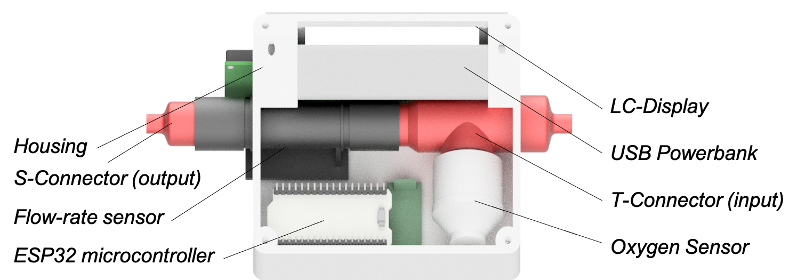
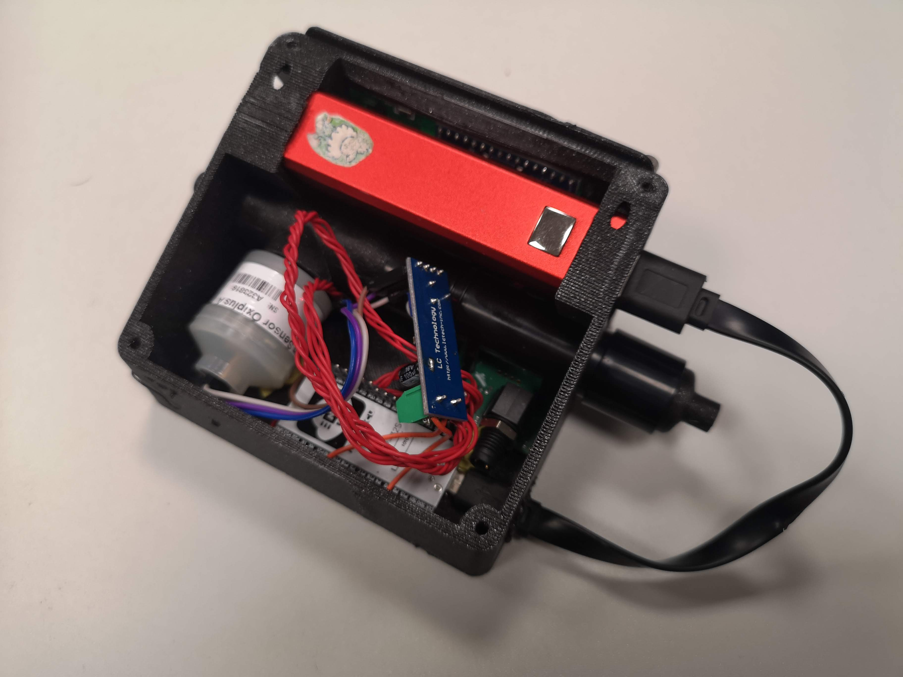
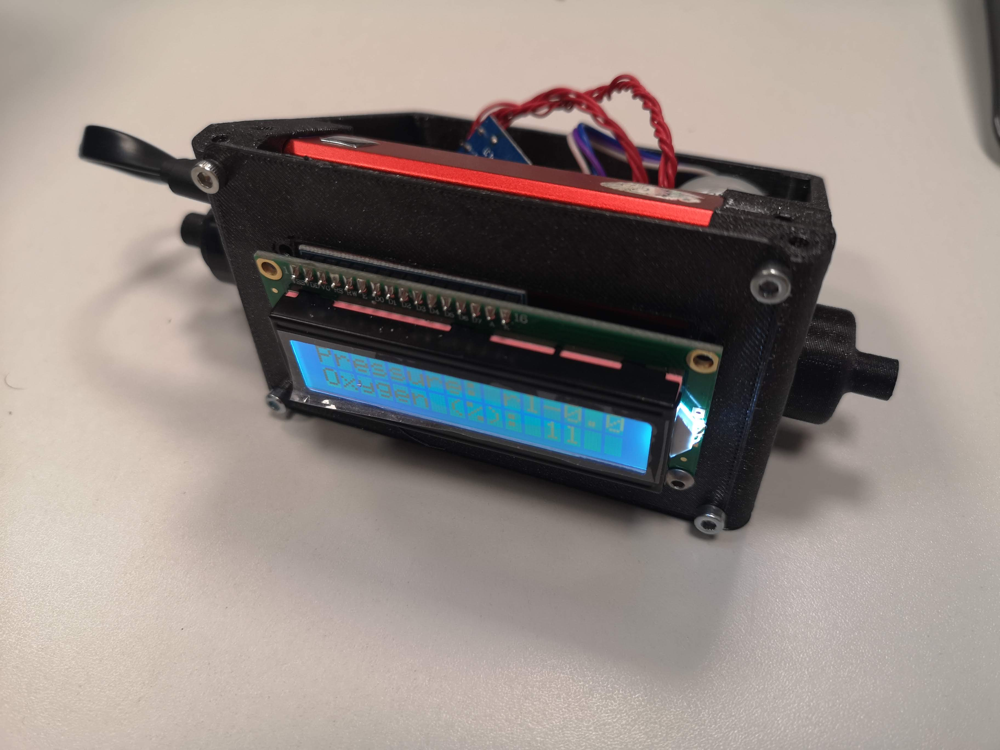
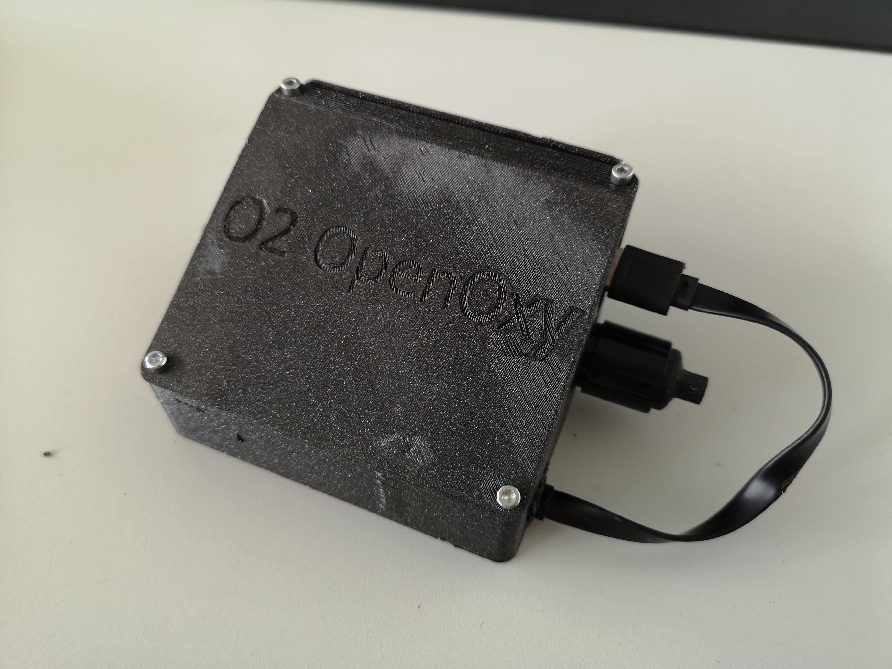
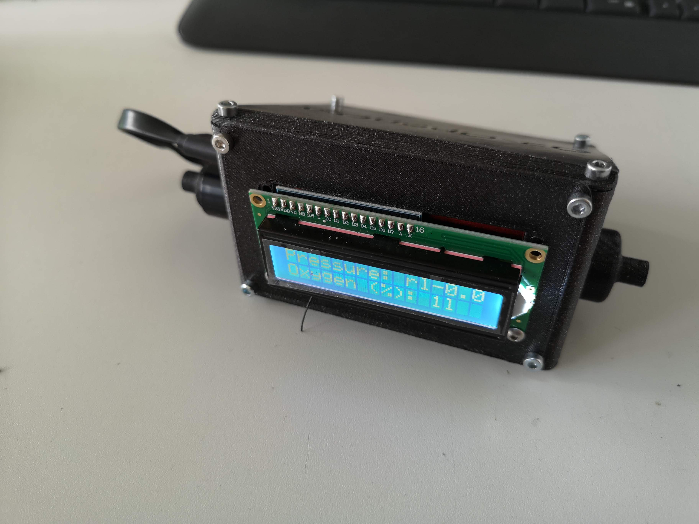
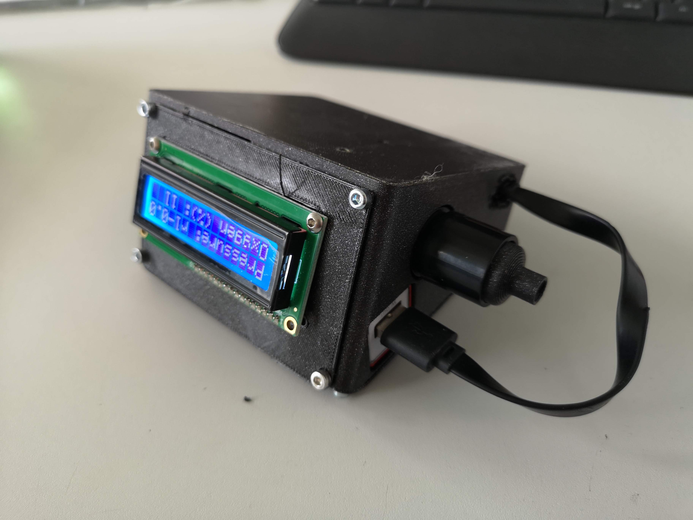
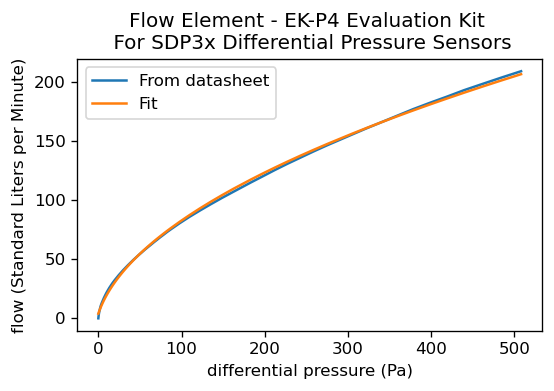

# Open Oxygen (O2) Flow Sensor

**WORK IN PROGRESS - more information will follow soon!**

This device is supposed to measure the oxygen flowrate of oxygen bottles.
We would like to have an open-source solution for something like the [TSI digital oxygen flow sensor](https://tsi.com/produkte/durchflussmesser,-durchflusssensoren-testsysteme/die-neuen-digitalen-durchflussmesser-serie-5000/).

<p align="center">
<a href="#logo" name="logo"></a>
</p>

***Features:***

- Open-Source
- Low-Cost (~150€)
- Based on 3D parts + off-the-shelf components
- Minimum of tools required
- Portable by relying on a USB power bank
- LCD for displying oxygen level and flowrate

# Electronics

The flowsensor and the display are connected to the ESP32 via I2C (GPIO 21/22 for SDA/SCL), wheras the Oxygen Sensor is connected to the board via an ampliefied (i.e. OPAMP) digital-analog port.

<p align="center">
<a href="#logo" name="Wiring"></a>
</p>

***WARNING:*** The OPAMP has a high-pass filter created by a capacitor + resistor. We need to remove this to let the low-frequency signal from the Oxygen Sensor pass through.

***Solution:*** Instead of relying on the internal ADC converter and have a rather unknwon OPAMP, we decided to go for digital-ADC with a dedicated I2C interface. 
The ADS1115 has 4 channels and a resolution of 16 Bit. 

<p align="center">
<a href="#logo" name="logo"></a>
</p>


In order to make the device independent from external energy sources, we incorporate a USB-battery/powersupply. We rely on a widely available form factor, where the brand/name of the device can largely vary. 


# CAD Files

The parts were designed in Autodesk Inventor 2019 student edition and can be found in the folder [./CAD](CAD)
An enclosure/box to keep all parts in place will be 3D printable.

<p align="center">
<a href="#logo" name="Wiring"></a>
</p>

*Arrangement of all the parts*

## Housing for the setup

The setup will have a housing for all the parts. Currently it looks like this, where the battery is sitting on top:

<p align="center">
<a href="#logo" name="Wiring"></a>
</p>

*Arrangement of all the parts*

<p align="center">
<a href="#logo" name="Wiring"></a>
</p>

All **3D printable** files can be found in [./STL](./STL)


# Assembly

*Sorry for the confusion:* You can mount the parts in both directions. Here, the CAD rendering shows the oxygen sensor on the right hand side, whereas the printed version shows it on the right hand side. Either way works!

1. Make sure you solder all parts together according to the wiring diagram above; To keep the wire chaos small: Twist the cables to form wire bundles; Test its proper functionality by e.g. running the [I2C scanner in the Arduino IDE](https://playground.arduino.cc/Main/I2cScanner/) (you must detect 2 addresses); Then flash the firmware in the Arduino folder.  ***HINT:*** There are some libraries involved; Please install them from the library downloader menu as described [here](https://www.arduino.cc/en/guide/libraries). The following libraries are used: `LiquidCrystal_I2C by Brabander and Sparkfun SDP3X by Sparkfun`
2. Place the LCD screen on the front plate and mount it with 4 M3x12 screws 
3. Place the flow-rate sensor (sensirion) on the plate by pushing one end through one of the wholes. Watch the photograph:

<p align="center">
<a href="#logo" name="Wiring"></a>
</p>

4. Now mount the S-connector to the outside of the injection moulded flow adapter (black plastic part of the sensirion); Beware: We don't mount the flow sensor permanently 
5. Mount the T-connector (tricky part, not much space); push the black flow adaptor at a side (e.g. diagonal) and try sneaking in the T-adaptor; Move the one thin end into the hole of the Flow sensor
6. Mount the Oxygen sensor to the open end of the T-connector inside the case 
7. Rotate the oxygen sensor the way that it resides on the base plate 
8. Place the ESP32 in the free spot on the base (no holes for screws, since the formfactor is largely varying!) 
9. Place the OPAMP in the assembly; make sure the open pin connects will **never** cause any shortcut!
10. Mount the LCD Screen using additional M3 screws:

<p align="center">
<a href="#logo" name="Wiring"></a>
</p>

11. Add the Powerbank in the desired slot and also add the USB Micro cable
<p align="center">
<a href="#logo" name="Wiring"></a>
</p>

12. Add the lid and mount it using M3 screws 
<p align="center">
<a href="#logo" name="Wiring"></a>
</p>

13. You are done! If you want to have the assembly working under an anble, you can simply rotate the screen: 

<p align="center">
<a href="#logo" name="Wiring"></a>
</p>


# Software

A first attempt to connect all components can be found in [./ARDUINO](./ARDUINO) (even though it's used by an ESP32, flash it in the Arduino IDE).

## Calibration


### Calibration of the air flow

The [datasheet](Sensirion_Differential_Pressure_AppNotes_EK-P4_Flow_Element.pdf) for the Sensirion EK-P4 Evaluation Kit
For SDP3x Flow sensor suggests a relationship between differential pressure and flow-rate measured in Standard Liters per Minute (slm). We fit a curve to the values given in the application note in order to have a parametrized function for the digital readout:


<p align="center">
<a href="#logo" name="Wiring"></a>
</p>

The corresponding Python script to generate this figure can be found [here](PYTHON/Fit_Flow_Calibration_Function.py). 

The fit suggest the following function: 

```py
def func(x, a, b, c, d):
    return a+np.sqrt(b+x*d)*c
  
  
a=-20.04843438
b=59.52168936
c=3.11050553
d=10.35186327
```

which can easily be implemented on the ESP32. 


Use previously measured calibration data? 

### Calibration of the oxygen level

no oxygen: Co2 from opened water bottles?

21% oxygen: air


# Bill of materials

- Misc Wires for connecting all parts (use proper soldered connection!)
- USB micro Cable for flashing the firmware and for supplying energy for portable-mode
- Various M3 Cylindrical Screws, M3x12mm, 1€ 
- [I2C LCD Display](https://de.aliexpress.com/item/32413056677.html?spm=a2g0o.productlist.0.0.37d82e0cBbmYmX&algo_pvid=b23eb3fa-26b7-4967-8927-370bceaf8f2b&algo_expid=b23eb3fa-26b7-4967-8927-370bceaf8f2b-0&btsid=0b0a050116225252291684896e9a75&ws_ab_test=searchweb0_0,searchweb201602_,searchweb201603_), **1,82€**
- [ads1115 Analog Digital Converter, 16Bit, I2C Breakoutboard](https://de.aliexpress.com/item/32584944400.html?albpd=de32584944400&acnt=494-037-6276&aff_platform=aaf&albpg=539263010115&netw=u&albcp=12554800262&pvid=433db5a0-d519-414b-b0ec-d81757d569be&sk=UneMJZVf&scm=1007.23534.124000.0&trgt=539263010115&terminal_id=97219810e62b4073bd503e68a1993030&needSmbHouyi=false&albbt=Google_7_shopping&src=google&crea=de32584944400&aff_fcid=fb140952e0f349409d47e72bc9efb9c4-1623130168444-07808-UneMJZVf&gclid=Cj0KCQjwh_eFBhDZARIsALHjIKew4RrgVYxvZKy29i_h_szASqZX6TG-UfPUJ0vnS9FvnMyJQTIaZqoaAhbkEALw_wcB&albag=127990761348&aff_fsk=UneMJZVf&albch=shopping&albagn=888888&isSmbAutoCall=false&aff_trace_key=fb140952e0f349409d47e72bc9efb9c4-1623130168444-07808-UneMJZVf&rmsg=do_not_replacement&device=c&gclsrc=aw.ds) (Need to be tested); **2,32€**
- [ESP32](https://de.aliexpress.com/item/1005002624723822.html?spm=a2g0o.productlist.0.0.40046b0bQsIciu&algo_pvid=8d944a26-1403-4761-8dc6-bcd81f928f2b&algo_expid=8d944a26-1403-4761-8dc6-bcd81f928f2b-0&btsid=0b0a050116225251145204377e9a75&ws_ab_test=searchweb0_0,searchweb201602_,searchweb201603_), **4,01€**
- [oxygen sensor oxiplus a 00a101](https://de.aliexpress.com/item/4000133941125.html?spm=a2g0o.search0302.0.0.6e2032aa3UHNHZ&algo_pvid=5e64a15b-e5e3-4262-905a-03d4820550db&algo_expid=5e64a15b-e5e3-4262-905a-03d4820550db-3&btsid=0b0a050116225250680124211e9a75&ws_ab_test=searchweb0_0,searchweb201602_,searchweb201603_); **50,01€**, [Datasheet](https://www.was-geisler.biz/WEBSERVER/Bausteine/Dateien/DB_AU-007_008.pdf)
- [Sensirion Evaluationskit EK-P4, SDP3X](https://www.digikey.de/product-detail/de/sensirion-ag/EK-P4/1649-1059-ND/6109354?utm_adgroup=General&utm_source=google&utm_medium=cpc&utm_campaign=Smart%20Shopping_Product_Zombie%20SKUs&utm_term=&productid=6109354&gclid=Cj0KCQjwktKFBhCkARIsAJeDT0igeZDRGKpHT8Bw-v7VJBCcK1TvZ1zT8fbia-CdzYWzZLNYBZ50_dcaAksxEALw_wcB); **50,10€**, [Datasheet](https://www.sensirion.com/en/flow-sensors/differential-pressure-sensors/test-your-sdp3x-differential-pressure-sensor-with-the-evaluation-kit-ek-p4/)
- [USB Powerbank, 5V, 2200mAh (make sure, the battery looks like the one above!)](https://www.ebay.de/p/1437454225); **2,10€**, The brand can vary, but make sure it's fitting in the housing)


# Contribute
If you have a question or found an error, please file an issue! We are happy to improve the device!

# License
Please have a look into the dedicated License file.

# Disclaimer
We do not give any guarantee for the proposed setup. Please use it at your own risk. Keep in mind that Laser source can be very harmful to your eye and your environemnt! It is not supposed to be used as a medical device!
